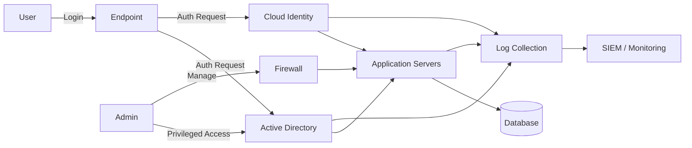

# Enterprise Architecture Diagram

```mermaid
flowchart LR

User -->|Login| Endpoint
Endpoint -->|Auth Request| AD[Active Directory]
Endpoint -->|Auth Request| AzureAD[Cloud Identity]

AD --> Apps[Application Servers]
AzureAD --> Apps

Apps --> DB[(Database)]

Apps --> Logs[Log Collection]
AD --> Logs
AzureAD --> Logs

Logs --> SIEM[SIEM / Monitoring]

Admin -->|Privileged Access| AD
Admin -->|Manage| Firewall

Firewall --> Apps
```

