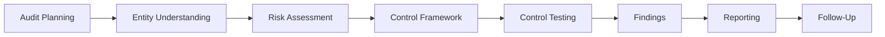

# Audit Lifecycle Diagram

```mermaid
flowchart LR

A[Audit Planning] --> B[Entity Understanding]
B --> C[Risk Assessment]
C --> D[Control Framework]
D --> E[Control Testing]
E --> F[Findings]
F --> G[Reporting]
G --> H[Follow-Up]
```

