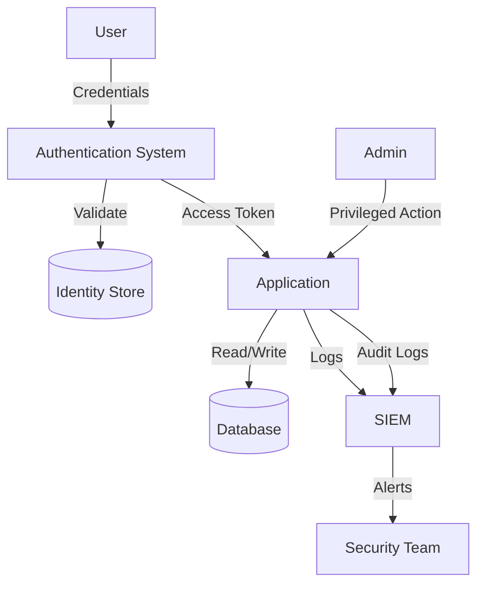

# Data Flow Diagram

```mermaid
flowchart TD

User -->|Credentials| Auth[Authentication System]
Auth -->|Validate| Identity[(Identity Store)]
Auth -->|Access Token| App[Application]

App -->|Read/Write| DB[(Database)]

App -->|Logs| SIEM[SIEM]

Admin -->|Privileged Action| App
App -->|Audit Logs| SIEM

SIEM -->|Alerts| Security[Security Team]
```

